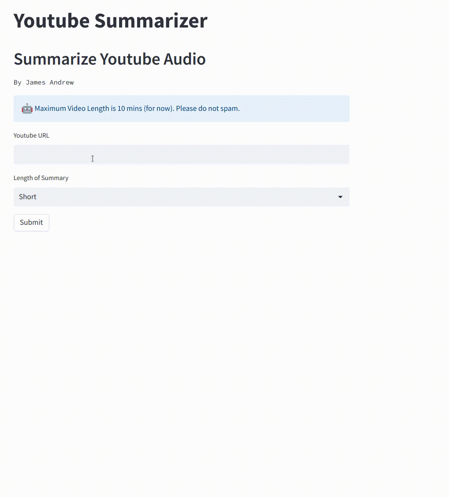

# Automated Youtube Video Summarizer using Whisper and GPT-3

A Python Streamlit application that uses OpenAI's Whisper and GPT-3 to summarize a Youtube video.



## Features
- Extracts audio from a Youtube video
- Runs transcription using OpenAI's Whisper
- Summarizes the transcription using OpenAI's GPT-3
- User-friendly Streamlit UI

# Requirements
- Python 3.9+
- Streamlit
- See `requirements.txt`

# Usage (Local)
- Clone the repository
- Install the required packages by running `pip install -r requirements.txt`
- Set Open API key
    ```
        export API_KEY=YOUR_KEYS_HERE
    ```
- Start the application
    ```
        streamlit run app.py
    ```
- Go to localhost:8501 on your browser

# Deploy using Docker
- Build docker `docker build -t summarizer:latest`
- Run via `docker run -it --gpus=all -e "API_KEY=YOUR_API_KEY" -p 8501:8501 summarizer:latest
Run the application by executing streamlit run app.py
Enter the Youtube video URL and let the application do the rest

# Note
This application is for demonstration purposes only and is not intended for commercial use. The summary generated may not be 100% accurate, please use at your own discretion.

# Conclusion
This application demonstrates the power of AI in natural language processing and text summarization. It is a great tool for quickly understanding the main points of a video and save time. Streamlit makes it easy to use and understand the results. With OpenAI's Whisper and GPT-3, it allows easy and accurate transcriptions and summarization.

# SEO Optimization
- Video Summary
- Python Streamlit
- OpenAI Whisper
- GPT-3
- Youtube Video Summary
- Text Summarization
- Natural Language Processing
- Streamlit UI
